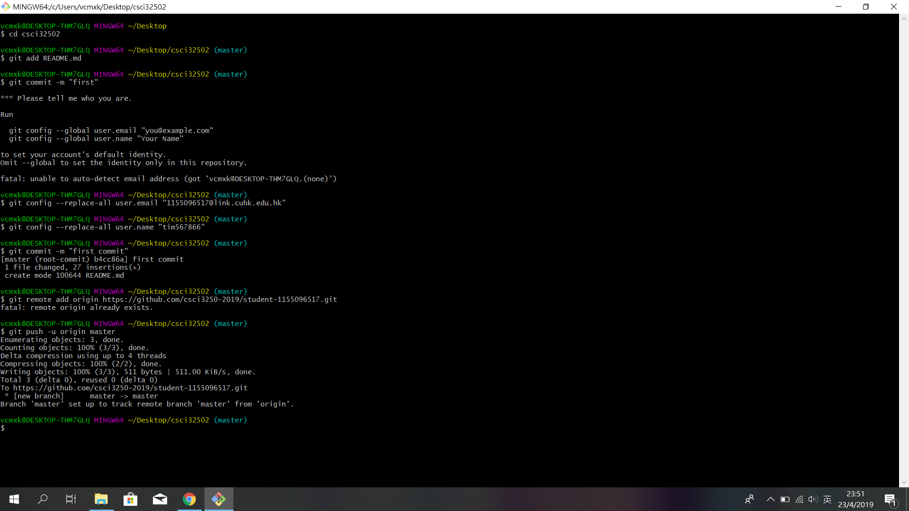

# Student info
*Name: Law Pak Hang*
Hi, I am **Tim**

# Known Program language
* C
* C++
* HTML
    * HTML5
    * little javascript
* CSS

# What is finished in this course
 [x] visit reports
 [x] individual article
 [ ] blog post comment and rating
 [x] Presentation

# Taking course
| Course code | Course name |
| ------ | ------ |
| CSCI3250 | Computers and Society |
| CSCI3251 | Engineering Practicum |
| CENG2010 | Digital Logic Design Laboratory |

